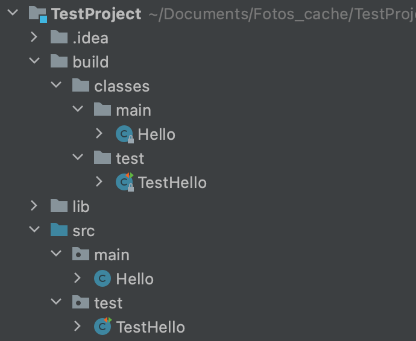

### Ant + Ivy configuration
First we need to know how we build and run simple Java project
#### 1. To compile the TestHello.java
```bash
javac -sourcepath src -cp lib/junit-4.13.2.jar:lib/hamcrest-all-1.3.jar src/test/TestHello.java -d build/classes
```


#### 2. To run TestHello
```bash
java -cp build/classes:lib/junit-4.13.2.jar:lib/hamcrest-all-1.3.jar org.junit.runner.JUnitCore test.TestHello
```
**After run**
```bash
> java -cp build/classes:lib/junit-4.13.2.jar:lib/hamcrest-all-1.3.jar org.junit.runner.JUnitCore test.TestHello  
JUnit version 4.13.2
.
Time: 0,006

OK (1 test)
```

To download ant 
https://ant.apache.org/srcdownload.cgi
To download ivy
https://ant.apache.org/ivy/download.cgi
To configure ant and ivy
```
nano ~/.bash_profile (or nano ~/.zprofile for mac)
```
``` bash
source ~/.profile
# Setting PATH for Python 3.10
# The original version is saved in .zprofile.pysave
ANT_HOME=/Users/alibaba/Downloads/apache-ant-1.10.12
IVY_HOME=/Users/alibaba/Downloads/apache-ivy-2.5.0
PATH="$IVY_HOME/ivy-2.5.0.jar:$ANT_HOME/bin:/Library/Frameworks/Python.framework/Versions/3.10/bin:${PATH}"
export PATH
```

Then as example run project in apache-ivy-2.5.0/example/hello-ivy running command `ant`
Then all must be done successfull
> Place your `apache-ivy-2.5.0.jar` into `apache-ant1.10.12/lib`

##Running our project 
###Sturcture of our project 
####build.xml 
1. compile -- компиляция исходных кодов проекта.
2. build -- компиляция исходных кодов проекта и их упаковка в исполняемый `jar`-архив. Компиляцию исходных кодов реализовать посредством вызова цели compile.
3. clean -- удаление скомпилированных классов проекта и всех временных файлов (если они есть).
4. test -- запуск junit-тестов проекта. Перед запуском тестов необходимо осуществить сборку проекта (цель build).
5. doc - добавление в `MANIFEST.MF` `MD5 и SHA-1` файлов проекта, а также генерация и добавление в архив javadoc по всем классам проекта.
6. alt - создаёт альтернативную версию программы с измененными именами переменных и классов (используя задание replace/replaceregexp в файлах параметров) и упаковывает её в `jar`-архив. Для создания `jar`-архива использует цель build.

**Before running** we must make signature of our `jar`-archive.
For that we must run following command:
```bash
keytool -genkey -alias name -keyalg RSA -keypass password -storepass password -keystore keystore.jks
```
After that we can build our project using command `ant build`