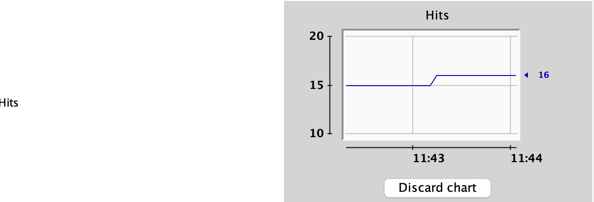

## Area checker (web app) + MBeans (JMX) + Profile and Monitoring systems (JConsole, ViusalVM, IDEA profiler)

### Project configuration
* <a href="https://ant.apache.org/bindownload.cgi">Download `ant`</a>
* <a href="https://ant.apache.org/ivy/download.cgi">Download `ivy`</a>
* place `ivy.jar` into `Application/IntelliJIDEA/lib/ant/lib/`
* In IDEA in `wildfly` run service edit configuration: select `run ant target ‘build’` + `war` (for deploy)
> In `File | Project Structure` place all of your `.jar` in library folder
### Jconsole 
To run, go into jdk on which was build your project (Look in `File | Project Structure | Project | Project SDK`) folder where places `./bin/jconsole.exe`. Run it
### VisualVM
#### To download
* <a href="https://visualvm.github.io/download.html">Download `VisualVM`</a>
* <a href="https://plugins.jetbrains.com/plugin/7115-visualvm-launcher/">Download `IDEA integration`</a>
* Download plugin for MBeans `Tools | Plugins | MBEANS`
### Lab's work process 
#### Jconsole 
С помощью утилиты JConsole провести мониторинг программы:

1. Снять показания MBean-классов, разработанных в ходе выполнения задания 1.


2. Определить версию Java Language Specification, реализуемую данной средой исполнения.


С помощью утилиты VisualVM провести мониторинг и профилирование программы:

1. Снять график изменения показаний MBean-классов, разработанных в ходе выполнения задания 1, с течением времени.



2. Определить имя потока, потребляющего наибольший процент времени CPU.


С помощью утилиты VisualVM и профилировщика IDE NetBeans, Eclipse или Idea локализовать и устранить проблемы с производительностью в программе. По результатам локализации и устранения проблемы необходимо составить отчёт, в котором должна содержаться следующая информация:
**TODO** change in `Main.java` from `Thread.sleep(200)` to `Thread.sleep(1)` 
**To identify** problem we started to test where and how fast the heap was grown. We see that the `byte[]` in `VisualVM | Sampler | Memory` is growing very fast. That can beacuse of memory leaks. (When the pointer to non-used object is stay with this object) and thats why Garbage Collector can't work as needed. To solve memory leak we saw the possible `static` fields (It can possibly call this problem). And after several times we seen that our program was crushed on place when it need to execute in `JavaScript.java` class `private void handleScriptException( Exception e, String badScript)` method. (in 7 of 10 situation). Then we saw that here is what we needed 
``` java 
 private static ArrayList _errorMessages = new ArrayList();
 ...
 private void handleScriptException( Exception e, String badScript ) {
            final String errorMessage = badScript + " failed: " + e;
            if (!(e instanceof EcmaError) && !(e instanceof EvaluatorException)) {
                e.printStackTrace();
                throw new RuntimeException( errorMessage );
            } else if (isThrowExceptionsOnError()) {
                e.printStackTrace();
                throw new ScriptException( errorMessage );
            } else {
                _errorMessages.add( errorMessage ); // Probably problem is here
            }
        }
 
```
#### How to solve
* Comment this line. But it changes our logic and can damage it. (Because if this varibale was created this take a meenenig with it self)
* It will be good to realize following: 
1. We collect 100 errors 
2. On 101-st error delete 1-st error e.t.c.

